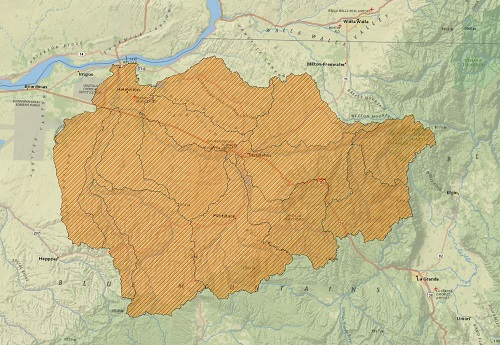

# farahani_shapefiletogeojason

### Umatilla Oregon

#### Data description:
This data is the boundries of watersheds in umatilla county that composed of 13
 subwatershed in Umatilla county located in north east of Oregon, US. These are
  one of the datasets that we use on our project (InterACTWEL). Our final project is
   a web based decision support system for adaptation planning between food, energy,
    and water (FEW)sectors using Nexus model. So we need different data that related to different actors.

#### Data detail:

 |file name                    | size (kb)  |
 |--------                     | --------   |
 |umatilla.geojason            | 1106       |
 |umatilla_simplified.geojason | 392        |
 |umatilla.topojson            | 105        |

 

 The limited nature of our shared resources drives the need for assistance
  to effectively coordinate demand, allocation, and efficient use of water,
   energy, and land within communities. This reality, compounded by threatened
    resource quality, requires coordination among stakeholders whose livelihoods
     depend on food and energy production and availability of water for consumptive
      and non- consumptive uses; these include: farmers, tribes, water managers,
       dam operators, industries, recreationalists, government agencies, and
        environmentalists. InterACTWEL, a secure and intelligent computer-aided
         decision support tool, empowers such actors to collaborate and coordinate
          management of natural resources over time. This highly flexible and navigable
           tool can be utilized in times of environmental disturbance or during implementation
            of new agricultural or environmental policies. Its intuitive interface examines impacts
             to goals, operations, and livelihoods for smarter natural resource management
              (i.e. adaptive management). To do so, this tool contains advanced scientific
               models and interactive optimization algorithms that allow individual actors to
               identify potential adaptation strategies while learning how those strategies affect
                other actors.